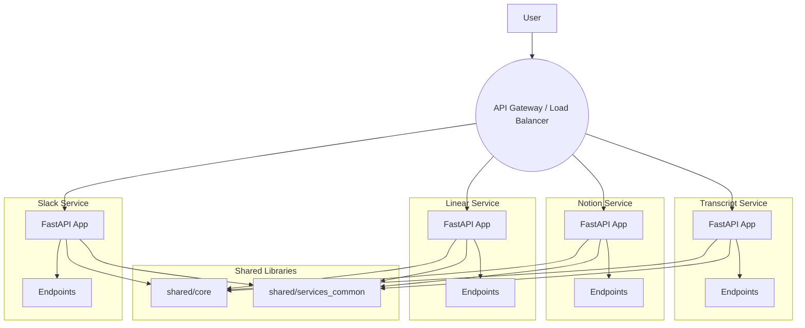

# Alpha Machine - Microservice Architecture

This document outlines the proposed microservice architecture for the Alpha Machine project, transitioning from a monolithic structure to a set of independent, standalone services.

## 1. Overview

The current application is a monolith, with all business logic ("flows") combined into a single FastAPI application. This architecture, while simple to start with, presents challenges for scalability, maintainability, and independent deployment.

To address these challenges, we are moving to a **microservices architecture**. Each distinct flow (`Slack`, `Linear`, `Notion`, `Transcript`) will be extracted into its own service. This will allow for:

*   **Independent Development & Deployment**: Each service can be developed, tested, and deployed without impacting others.
*   **Scalability**: Services can be scaled independently based on their specific load.
*   **Technology Heterogeneity**: While we will start with Python/FastAPI for all services, this architecture allows for using different technologies for different services in the future if needed.
*   **Improved Fault Isolation**: An issue in one service is less likely to bring down the entire system.

## 2. Directory Structure (Monorepo)

We will adopt a monorepo structure to manage our services. All code will continue to live in the `alpha-machine` repository but will be organized as follows:

```
alpha-machine/
├── docs/
│   └── architecture.md
├── services/
│   ├── slack/
│   │   ├── src/
│   │   ├── pyproject.toml
│   │   └── Dockerfile
│   ├── linear/
│   │   └── ...
│   ├── notion/
│   │   └── ...
│   └── transcript/
│       └── ...
└── shared/
    ├── core/
    │   ├── pyproject.toml
    │   └── src/
    └── services_common/
        └── ...
```

*   `services/`: This directory will contain the individual microservices. Each subdirectory is a self-contained application.
*   `shared/`: This directory will house code shared across multiple services. This code will be packaged as libraries that the services can depend on.

## 3. Shared Code Management

Shared functionality, such as the code currently in `src/core` and common service clients (e.g., `SupabaseService`), will be extracted into shared libraries under the `shared/` directory.

*   **Local Development**: For local development, services will use `path` dependencies in their `pyproject.toml` to reference these shared libraries.
*   **Production**: For production builds, these shared libraries can be published to a private package repository (like Gemfury, or a private PyPI) and installed as regular dependencies.

## 4. Dependency Management

Each service in the `services/` directory will have its own `pyproject.toml` file. This is fundamental to achieving independent builds. It ensures that each service only includes the dependencies it strictly needs, leading to smaller and more efficient container images.

## 5. Proposed Architecture Diagram

The following diagram illustrates the target architecture:



## 6. Proof of Concept: Migrating the Slack Flow

To validate this approach, we will begin by migrating the `slack_flow` into its own service as a proof of concept. This will involve:

1.  Creating the `services/slack` and `shared/core` directories.
2.  Moving the relevant Slack code into `services/slack/src`.
3.  Extracting shared utilities and models into `shared/core/src`.
4.  Creating `pyproject.toml` files for both the new service and the shared library.
5.  Ensuring the new Slack service can run independently. 